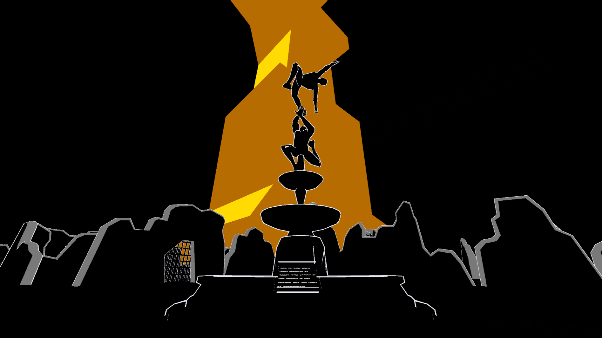
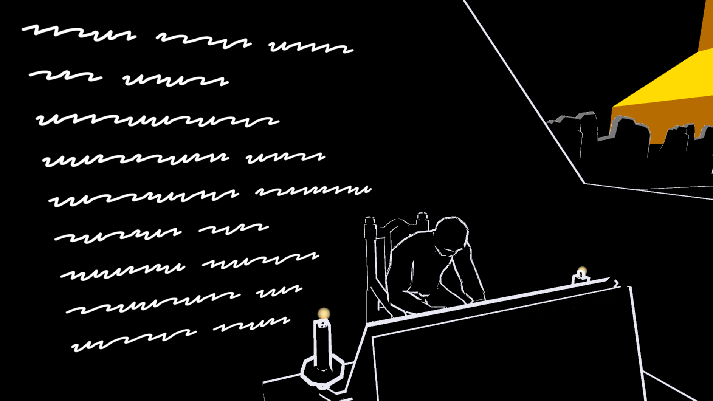

# The Scholar and The Orphan King

<i>"The Scholar had been camping at the edge of the desert for days, preparing for his journey to The Settlements. He had spent his time gathering supplies, checking his equipment, and studying maps of the surrounding area. The ruins of abandoned villages dotted the landscape, and he knew that he would need to navigate them carefully if he was going to make it to The Spire..."<i>

<b>"The Scholar and the Orphan King"</b> is an interactive narrative where the player takes on the role of the Archivist. Players embark on a journey that revolves around the story of the Scholar and his pursuit of knowledge, and his quest to meet the enigmatic figure known as the Orphan King.

[View on Itch.io](https://mttjns.itch.io/the-scholar-and-the-orphan-king) 
[View on Youtube](https://youtu.be/vpYRCFP9YtQ)
